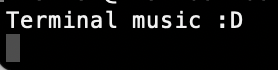
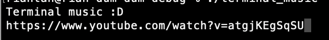
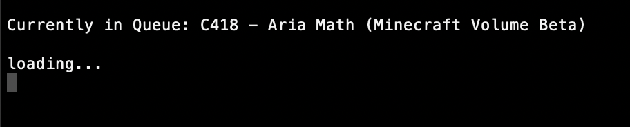
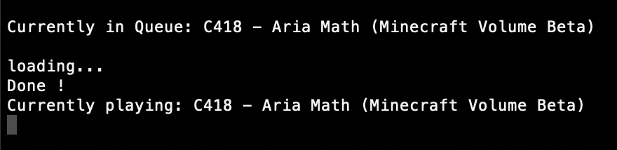

# Terminal-music
## A simple and minimalistic terminal music player

### TODO: 
- [x] get file from youtube
- [x] convert mp4 file to mp3 and play it
- [ ] search function
- [ ] add custom queue and playlist function
- [ ] add loop capabilities

## How to use this project:

### Disclaimer: requires ffmpeg to be installed for it to run properly

1. run the executable

2. get the video url from youtube

3. paste the url in

4. wait for the program to download and process the video

5. enjoy

